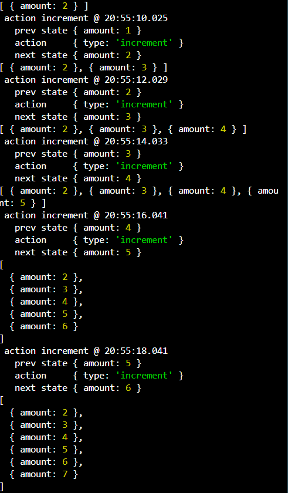

how to intilize the value of state commit output:

how to increment the value of state, see the output:

add the data in history array

install the middleware: 
npm i redux-logger

add a middlware in store, why add the middle ware in store? if you set the middleware, changed the output every timestamp:

add payload in store 

install the json server
what is the usees of json-server,because we are worked on json data so used it this things.

$npm i -g json-server
run the json-server: $json-server db.json

