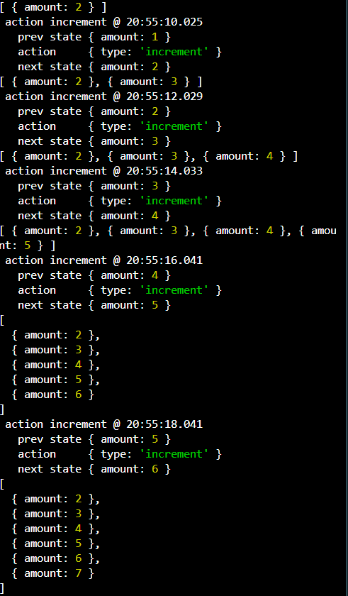

how to intilize the value of state commit output:

how to increment the value of state, see the output:

add the data in history array

install the middleware:
npm i redux-logger

add a middlware in store, why add the middle ware in store? if you set the middleware, changed the output every timestamp:

add payload in store

install the json server
what is the usees of json-server,because we are worked on json data so used it this things.

$npm i -g json-server
run the json-server: $json-server db.json

add a new middleware redux-things
npm i redux-things

output:

action undefined @ 10:06:52.949
prev state { amount: 1 } // initial state ki value 1 thi
action [AsyncFunction: initUser] // fir ek asyncfunction add hua function ka name hai initUser
next state { amount: 1 } // function add hone ke baad amount ki value chanage nahi hue, because jab aap koi async function ko jodte ho to state ruk jata hai, so state change nahi hua
action init @ 10:06:52.996
prev state { amount: 1 } // initial state ki value 1 thi
action { type: 'init', payload: 100 } // initUser function call kiya to amount data 100 thi
next state { amount: 100 } // final value 100 hai

// setInterval me data regular run karta hai
// set TImeout me data only one time run karta hai

see the output of handing the function:

