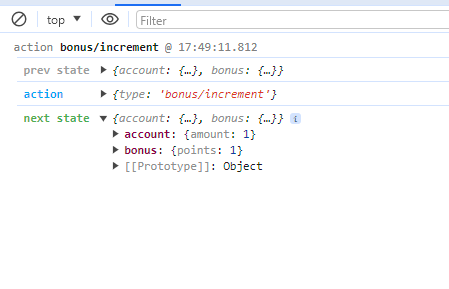

$ npm i redux
$ npm i redux-logger redux-thunk

if you press the in crement bonus value are changed, see the output in console:

$ npm i react-redux

start the json server:
$ json-server db.json -p 8080  // -p means port no is 8080
